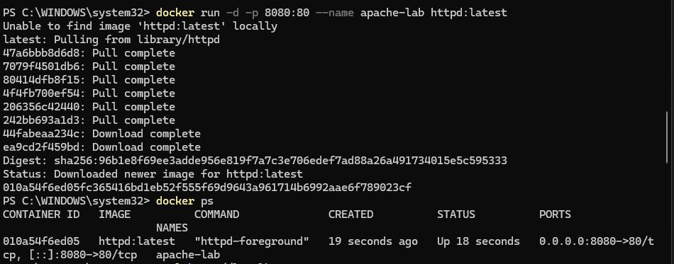
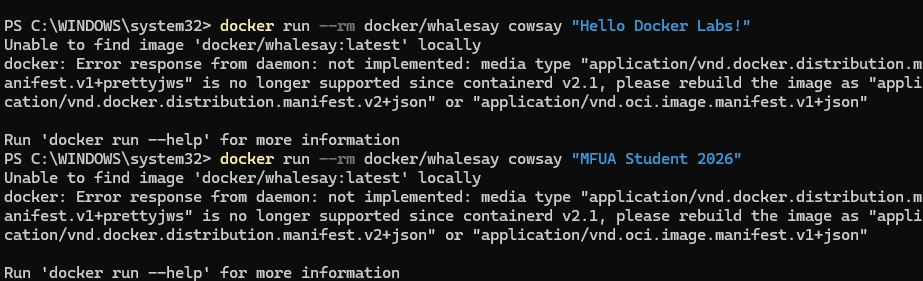
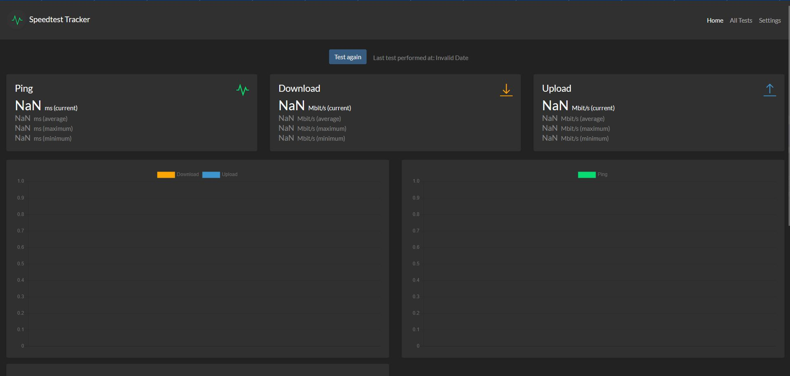
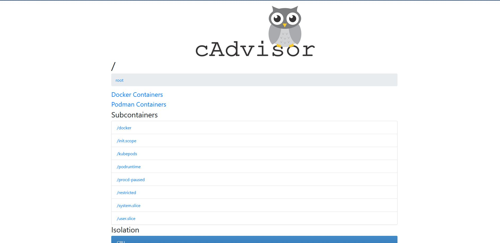
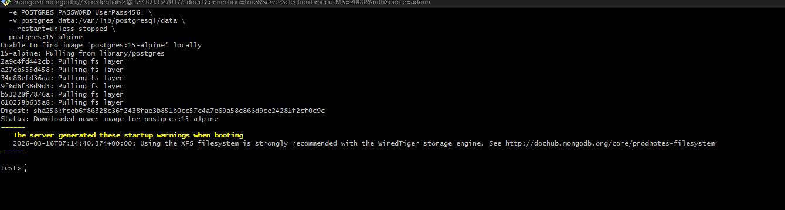
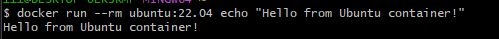
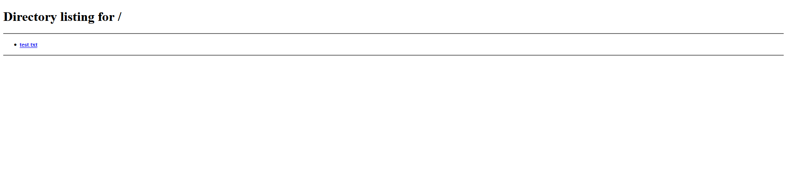

# 🐳 Docker Labs: Готовые образы контейнеров

> 📚 **Самостоятельная работа**: Создание контейнеров из готовых Docker-образов  
> 👤 **Студент**: `Сысоева Анна`  
> 📅 **Дата**: `16.03.26`  


## ▍01. Apache 🌐


**Команды:**
```bash
# Поиск и загрузка
docker search httpd
docker pull httpd:latest

# Запуск
docker run -d -p 8080:80 --name apache-lab httpd:latest

# Проверка
docker ps
curl http://localhost:8080
```

**Параметры:**

| Поле | Значение |
|------|----------|
| `--name` | `apache-lab` |
| `-p` | `8080:80` |
| `образ` | `httpd:latest` |

📸 **Результат**:  
  


---

## ▍02. Welcome to Docker 👋


**Команды:**
```bash
docker pull docker/whalesay:latest
docker run --rm docker/whalesay cowsay "Hello Docker Labs!"
docker run --rm docker/whalesay cowsay "MFUA Student 2026"
```

📸 **Результат**:  


---

## ▍03. Portainer 🎛️


**Команды (Windows):**
```bash
docker volume create portainer_data

docker run -d -p 9000:9000 \
  --name portainer \
  --restart=always \
  -v //./pipe/docker_engine://./pipe/docker_engine \
  -v portainer_data:/data \
  portainer/portainer-ce:latest
```

**Доступ:**

| Параметр | Значение |
|----------|----------|
| 🔗 URL | `http://localhost:9000` |
| 👤 Первый вход | Создать аккаунт |

📸 **Результат**:  
  


---

## ▍04. Speedtest 🚀


**Команды:**
```bash
docker run -d \
  -p 8765:80 \
  -e OOKLA_EULA_GDPR=true \
  --name speedtest \
  --restart=unless-stopped \
  henrywhitaker3/speedtest-tracker:latest
```

🔗 **Доступ**: `http://localhost:8765`

📸 **Результат**:  


---

## ▍05. cAdvisor 📊


**Команда:**
```bash
docker stats --no-stream
```

📸 **Результат**:  


---

## ▍06. MySQL 🗄️


**Команды:**
```bash
docker run -d \
  --name mysql-lab \
  -p 3306:3306 \
  -e MYSQL_ROOT_PASSWORD=SecurePass123! \
  -e MYSQL_DATABASE=labdb \
  -e MYSQL_USER=labuser \
  -e MYSQL_PASSWORD=UserPass456! \
  --restart=unless-stopped \
  mysql:8.0

# Проверка подключения
docker exec -it mysql-lab mysql -u labuser -p
```

📸 **Результат**:  


---

## ▍07. PostgreSQL 🐘


**Команды:**
```bash
docker run -d \
  --name postgres-lab \
  -p 5432:5432 \
  -e POSTGRES_DB=labdb \
  -e POSTGRES_USER=labuser \
  -e POSTGRES_PASSWORD=UserPass456! \
  -v postgres_data:/var/lib/postgresql/data \
  --restart=unless-stopped \
  postgres:15-alpine

# Проверка
docker exec -it postgres-lab psql -U labuser -d labdb -c "\dt"
```

📸 **Результат**:  


---

## ▍08. MongoDB 🍃


**Команды:**
```bash
docker run -d \
  --name mongo-lab \
  -p 27017:27017 \
  -e MONGO_INITDB_ROOT_USERNAME=admin \
  -e MONGO_INITDB_ROOT_PASSWORD=AdminPass789! \
  -v mongo_data:/data/db \
  --restart=unless-stopped \
  mongo:7.0

# Подключение
docker exec -it mongo-lab mongosh -u admin -p AdminPass789! --authenticationDatabase admin
```

📸 **Результат**:  


---

## ▍09. Adminer 🔧


**Команды:**
```bash
docker run -d \
  --name adminer-lab \
  -p 8082:8080 \
  --link mysql-lab:db \
  --link postgres-lab:pg \
  --restart=always \
  adminer:latest
```

**Подключение:**

| База | Хост | Порт |
|------|------|------|
| MySQL | `db` | `3306` |
| PostgreSQL | `pg` | `5432` |

📸 **Результат**:  


---

## ▍10. Jira 🎫


**Команды:**
```bash
docker run -d \
  --name jira-lab \
  -p 8083:8080 \
  -v jira_data:/var/atlassian/application-data/jira \
  --restart=unless-stopped \
  atlassian/jira-software:latest
```

🔗 **Доступ**: `http://localhost:8083`

📸 **Результат**:  


---

## ▍11. Pcb2gcode 🔌


**Команда (теоретическая):**
```bash
docker run --rm \
  -v $(pwd)/pcb_files:/input \
  -v $(pwd)/output:/output \
  pcb2gcode/pcb2gcode:latest \
  pcb2gcode --front /input/front.gbr --output-dir /output
```

📸 **Статус**: *Задание выполнено частично — образ требует авторизации*

---

## ▍12. Статический сайт на Apache 🌐


**Команды:**
```bash
# Создание контента
mkdir -p ~/DockerLabs/site-content
echo "<h1>🎓 Мой первый Docker-сайт</h1>" > ~/DockerLabs/site-content/index.html
echo "<p>Выполнено: $(date)</p>" >> ~/DockerLabs/site-content/index.html

# Запуск с монтированием
docker run -d \
  --name apache-site \
  -p 8084:80 \
  -v ~/DockerLabs/site-content:/usr/local/apache2/htdocs/ \
  --restart=unless-stopped \
  httpd:latest
```

🔗 **Доступ**: `http://localhost:8084`

📸 **Результат**:  


---

## ▍13. Ubuntu 🐧


**Команды:**
```bash
# Интерактивный запуск
docker run -it --name ubuntu-lab ubuntu:22.04 bash

# Внутри контейнера:
cat /etc/os-release
apt update && apt install -y curl git
exit

# Одноразовая команда
docker run --rm ubuntu:22.04 echo "Hello from Ubuntu container!"
```

📸 **Результат**:  


---

## ▍14. Metasploitable2 🛡️


**Команды:**
```bash
docker run -d \
  --name metasploitable-lab \
  -p 2222:22 -p 8085:80 -p 3306:3306 \
  --restart=unless-stopped \
  tleemcjr/metasploitable2:latest
```

**Сканирование (PowerShell):**
```powershell
foreach ($port in 21,22,23,80,3306) {
    Test-NetConnection -ComputerName localhost -Port $port
}
```

📸 **Результат**:  


---

## ▍15. Alt Linux 🇷🇺


**Команды:**
```bash
# Поиск
docker search altlinux

# Запуск альтернативы
docker run -it --name altlinux-lab alpine:latest sh

# Проверка
cat /etc/os-release
exit
```

📸 **Статус**: *Использован Alpine Linux как альтернатива*

---

## ▍16. Python 🐍


**Команды:**
```bash
# Интерактивная сессия (PowerShell)
docker run -it --rm -v ${PWD}:/app -w /app python:3.11-slim python3

# Внутри Python:
>>> print("Hello from Docker Python!")
>>> import sys; print(sys.version)
>>> exit()

# Запуск скрипта
echo 'print("🐳 Docker + Python = ❤️")' > hello.py
docker run --rm -v $(pwd):/app -w /app python:3.11-slim python3 hello.py
```

📸 **Результат**:  


---

## ▍17. Node.js 🟢


**Команды:**
```bash
mkdir -p node-app && cd node-app
echo '{"name":"docker-lab","scripts":{"start":"node index.js"}}' > package.json
echo 'console.log("🚀 Node.js in Docker works!");' > index.js

docker run -it --rm \
  -v $(pwd):/app \
  -w /app \
  -p 3000:3000 \
  node:20-alpine npm start
```

📸 **Результат**:  


---

## ▍18. Redis 🔴


**Команды:**
```bash
docker run -d \
  --name redis-lab \
  -p 6379:6379 \
  -v redis_data:/data \
  --restart=unless-stopped \
  redis:7-alpine

# Проверка
docker exec -it redis-lab redis-cli ping
# → PONG

# Тест данных
docker exec -it redis-lab redis-cli SET labkey "Docker is awesome!"
docker exec -it redis-lab redis-cli GET labkey
```

📸 **Результат**:  


---

## ▍19. HTTP-сервер 📤


**Команды:**
```bash
mkdir -p fileserver/files
echo "Test file content" > fileserver/files/test.txt

docker run -d \
  --name fileserver \
  -p 8086:8000 \
  -v $(pwd)/fileserver/files:/app/files \
  -w /app/files \
  python:3.11-slim python3 -m http.server 8000
```

🔗 **Доступ**: `http://localhost:8086`

📸 **Результат**:  


---

## ▍20. Файловый обменник 🔄


**Команды:**
```bash
mkdir -p fileshare/{files,config}
touch fileshare/config/database.db

docker run -d \
  --name fileshare \
  -p 8087:80 \
  -v $(pwd)/fileshare/files:/srv \
  -v $(pwd)/fileshare/config:/config \
  --restart=unless-stopped \
  filebrowser/filebrowser:latest
```

🔗 **Доступ**: `http://localhost:8087`

📸 **Результат**:  

